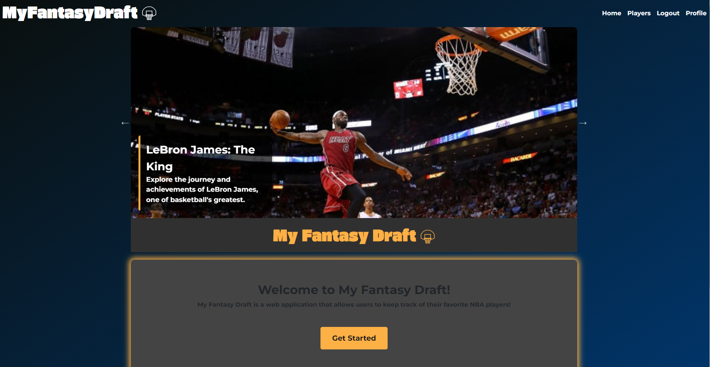
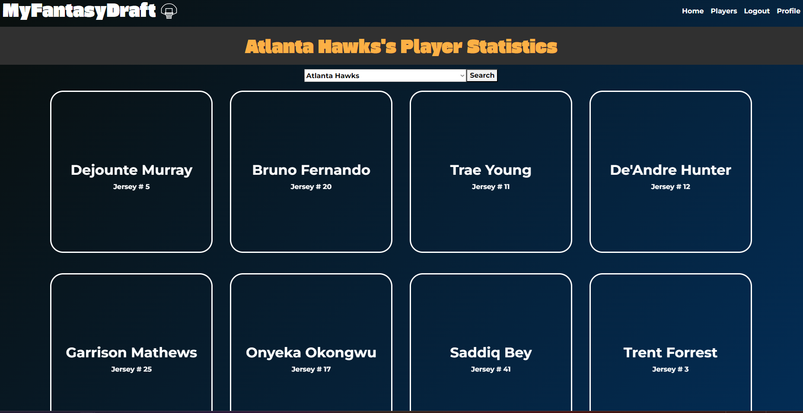

# My Fantasy Draft

Deployed Date: 12/10/2023  
Deployed Site: https://myfantasydraft-3b76c1450b6a.herokuapp.com

# Table of Contents

[Description](#description)  
[Usage](#usage)  
[Future Development](#future-development) 
[Technologies](#technologies) 
[Our Githubs](#githubs)  
[Credit](#credit)  
  
## Description 
  
My Fantasy Draft uses the  to search for and provide the average stats for a NBA player for the current season. User's can make use of our search function to find players with good stats, or their favorite players from their favorite teams, and save them into a Fantasy Draft team, which they can quickly look at from their profile page. They can use this to put together the fantasy team of their dreams, or to easily find players for any team ideas they have.

User Story:
- AS A fantasy sports player
- I WANT a website to find players and get their current stats
- SO THAT I can search for good players and create my team

Acceptance Criteria:
- GVEN My Fantasy Draft
- WHEN I first visit the website
- THEN I am presented with the homepage and sports news
- WHEN I click on the login button
- THEN I am given the option to either login or create an account
- WHEN I login or create an account
- THEN I am brought to the players page and can select a team
- WHEN I search for a teams players
- THEN I am presented with cards containing a player's name and jersey number
- WHEN I click on a player's card
- THEN I the card flips over and shows the player's stats and a save button
- WHEN I am logged in and click the save button
- THEN I can save a player onto my fantasy team
- WHEN I go to my profile page
- THEN I am shown all the players save to my fantasy team

## Usage 

Go to our [Website](https://myfantasydraft-3b76c1450b6a.herokuapp.com) and you'll see our home page with a lot of information about current teams and players in the NBA. If you check out the navigation bar on the upper right hand side, you'll see a login page. When you go to the login page, you will be able to login or create an account if you don't already have one. After you log in, you are directed to the players page! At the players page, you will see a drop down of all 30 teams in the NBA and will be able to go through the teams. Every time you select a team and press "search", you are given cards of all the current players from the current season, when you click on a card of your desired player, it will flip and give you that players current stats. You will also see an "add player" button, and when you press this button, the player (along with the stats) will be saved to your profile. NOTE: You will only be able to add/remove a player if you have an account with this application. You can then press the "profile" page on the navigation bar and here, you will see the player that you have added. You are also able to press the trash button in order to remove that player. You are able to save up to 10 players on your page so have fun creating your dream team!

## Future Development 

Of course there is always room for improvement, so we wish to one day add multiple sports onto this application, so that users can choose the sport that they desire and can participate in more than just the NBA! We also hope to be able to add every player's picture in the front of their cards. 

## Technologies 

<ul>
    <li>Vite JS</li>
    <li>Node JS</li>
    <li>React JS</li>
    <li>Bootstrap</li>
    <li>Graphql</li>
    <li>Jquery</li>
    <li>Json Web Token</li>
    <li>Bcrypt</li>
    <li>Express JS</li>
    <li>Mongoose</li>
    <li>Slick Carousel</li>
    <li>Apollo</li>
</ul>

## Our Githubs 

[Jae Kim](https://github.com/Jaek23)  
[Devan Capps](https://github.com/devancapps)  
[Devon McFarlen](https://github.com/DevonMcFarlen)  
[Prayusha Pandey](https://github.com/prayushapandey04)  
[Franco Folgarait](https://github.com/frankiebelize)  

## License
   This project is covered under the MIT license
